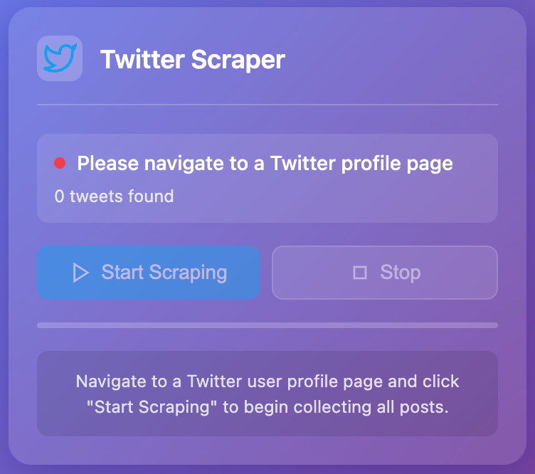

# Twitter 帖子抓取器 Chrome 扩展



一个强大的 Chrome 扩展，可以自动抓取 Twitter 用户个人资料中的所有帖子并将其导出为有组织的 JSON 数据。

## 功能特性

- **智能个人资料检测**：自动检测 Twitter/X 用户个人资料页面
- **自动滚动**：通过自动滚动逐步加载所有推文
- **全面数据提取**：捕获文本、时间戳、作者信息、互动指标、媒体和链接
- **实时进度**：显示抓取进度和推文数量的实时更新
- **JSON 导出**：干净、结构化的 JSON 导出，包含所有抓取的数据
- **美观界面**：现代化、响应式弹出界面，具有流畅动画效果

## 安装

1. 下载或克隆此仓库
2. 打开 Chrome 并导航到 `chrome://extensions/`
3. 在右上角启用"开发者模式"
4. 点击"加载已解压的扩展程序"并选择扩展文件夹
5. Twitter 抓取器图标将出现在您的扩展工具栏中

## 使用方法

1. 导航到任何 Twitter/X 用户个人资料页面（例如，`https://twitter.com/username`）
2. 点击工具栏中的 Twitter 抓取器扩展图标
3. 扩展将检测个人资料并显示用户信息
4. 点击"开始抓取"开始收集推文
5. 观看推文被发现时的实时进度
6. 随时点击"停止"暂停过程
7. 点击"导出 JSON"下载抓取的数据

## 数据结构

导出的 JSON 包含推文对象数组，具有以下结构：

```json
[
  {
    "id": "1234567890",
    "text": "推文内容...",
    "author": {
      "name": "显示名称",
      "handle": "@用户名"
    },
    "timestamp": "2024-01-15T10:30:00.000Z",
    "timeText": "1月15日",
    "engagement": {
      "replies": 42,
      "retweets": 128,
      "likes": 512
    },
    "media": [
      {
        "type": "image",
        "url": "https://pbs.twimg.com/media/...",
        "alt": "图片描述"
      }
    ],
    "links": [
      {
        "url": "https://example.com",
        "text": "链接文本"
      }
    ],
    "url": "https://twitter.com/username/status/1234567890",
    "scrapedAt": "2024-01-15T12:00:00.000Z"
  }
]
```

## 技术细节

- 使用 Chrome 扩展 Manifest V3
- 实现内容脚本进行 DOM 交互
- 自动滚动检测和速率限制
- 强大的错误处理和恢复
- 内存高效的推文去重
- 支持 twitter.com 和 x.com 域名

## 权限

- `activeTab`：访问当前标签页内容进行抓取
- `scripting`：将内容脚本注入到 Twitter 页面
- `downloads`：启用 JSON 文件导出
- `host_permissions`：访问 Twitter/X 域名

## 浏览器兼容性

- Chrome 88+
- Edge 88+
- 任何支持扩展的基于 Chromium 的浏览器

## 许可证

MIT 许可证 - 可自由修改和分发 